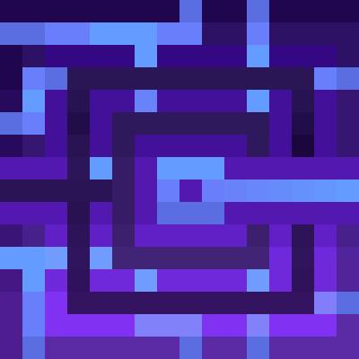
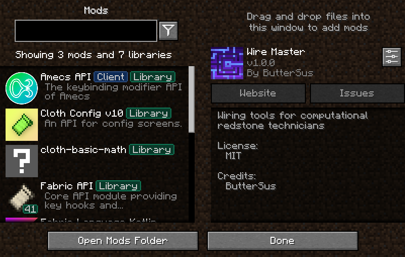

<!--suppress CheckImageSize -->

# Wire Master

Minecraft Fabric client and server side mod. It provides toggleable & configurable wire designer tool
to help with wiring redstone lines.

> **W.I.P:** Wire Master will have an option to run it only as client-side mod.

## License

This mod is available under [the MIT License](LICENSE).
