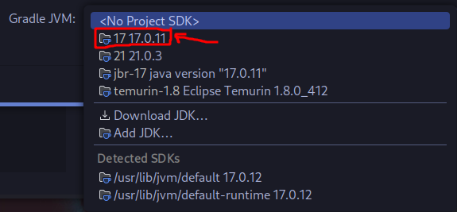
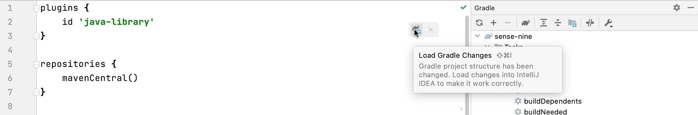
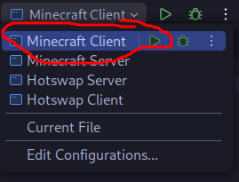
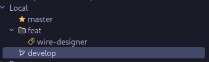

# Developer Guide

Welcome to the Developer Guide for WireMaster!
This document provides detailed instructions to get your development environment set up and contribute effectively.


## Prerequisites

Before you start, ensure you have the following installed:

- **Intellij IDEA**: As it's recommended to use by [fabric wiki](https://docs.fabricmc.net/develop/getting-started/setting-up-a-development-environment).
- **Java 17+**: Required JDK for building and running the project
  - It's recommended to use Jetbrains Runtime, since it supports hotswapping. You can do it via [IDEA](https://www.jetbrains.com/guide/java/tips/download-jdk/), it'll be shown later in this guide.
- **Git**: You can google it and install it if you don't already have it.

That's all, everything else will be installed automatically.

## Getting Started

1. Clone the repository.

   ```bash
   git clone https://github.com/ButterSus/WireMaster
   ```

   It's recommended to use the IDEA project manager to clone the repository, see [this tutorial](https://www.jetbrains.com/guide/java/tutorials/import-project/project-from-version-control/).

2. Setup your `.idea` directory. Since git tracks all files in the repository, it's generally a bad idea to store all configuration files tracked. So, instead, we've put templates in the `.idea` directory.

   You can load default configuration files using bash script `scripts/setup_idea_configs.sh`:

   ```bash
   ./scripts/setup_idea_configs.sh
   ```

   If you're on Windows, you can do execute it using Git Bash (you can find it in search bar).

3. Set up your chosen SDK for project. Go to `File | Project Structure | Project | SDK`.
   
   

   After that make sure to load gradle changes.

   

4. Run `./gradlew runClient` or this button:
   
   .

Enjoy, have fun!

## Contributing

We have 3 branches: `develop`, `master`, `feat/existing-feature`.
All changes should be done in `develop` branch, and then merged to `master` or `feat/existing-feature`.



Create new branch from `develop`, typically called `feat/your-feature-name`. Then, you can start working on it.

> Also, make sure you don't delete any files in `.idea` folder by mistake in your commit.

If you have any questions, feel free to ask me: `buttersus@mail.ru`.
You can create pull requests and issues on [GitHub](https://github.com/ButterSus/WireMaster).
